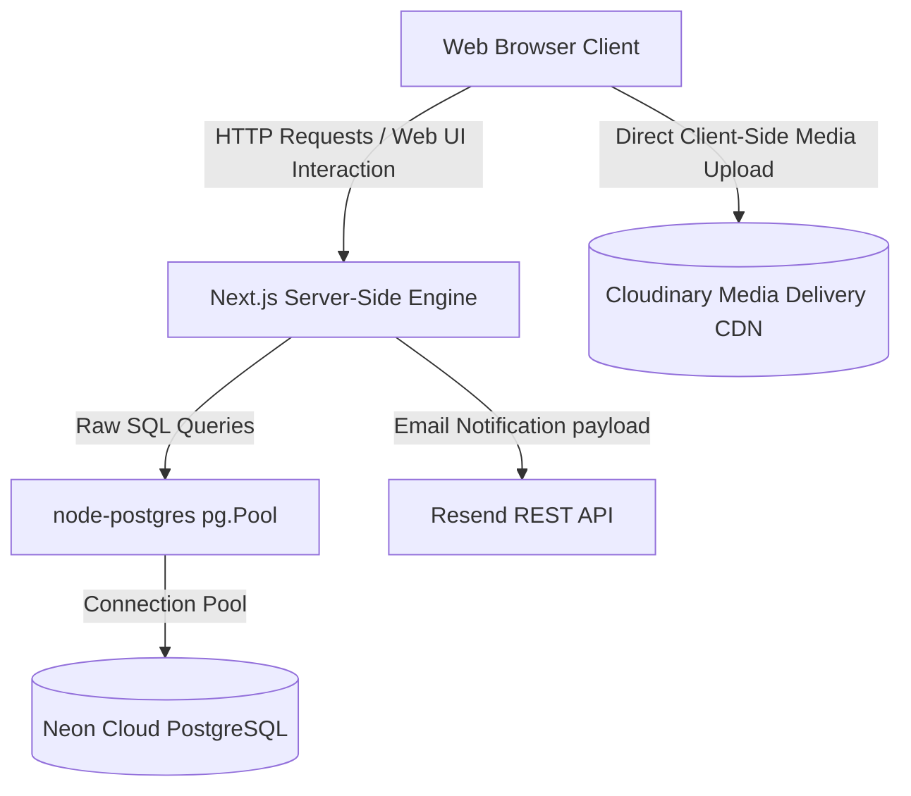
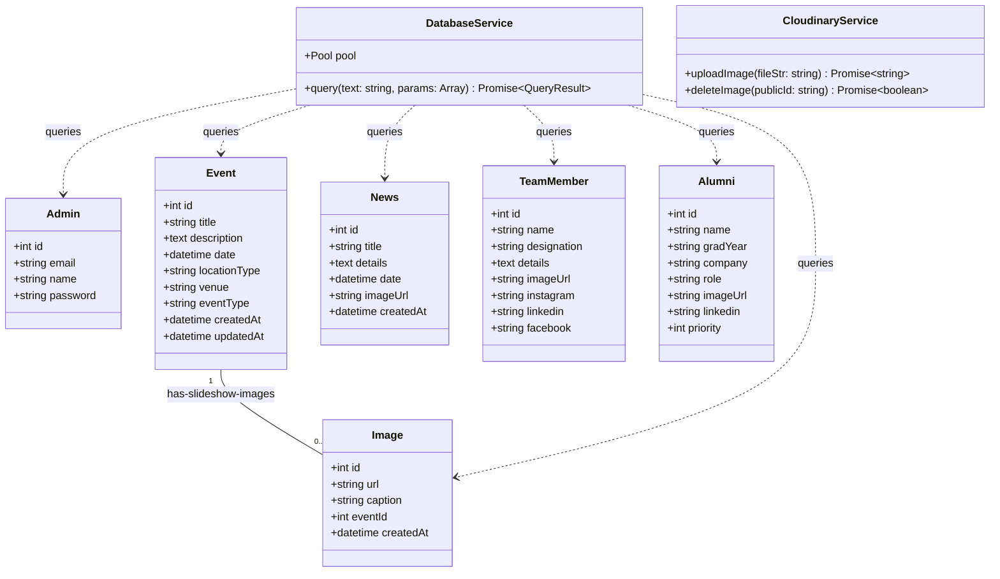
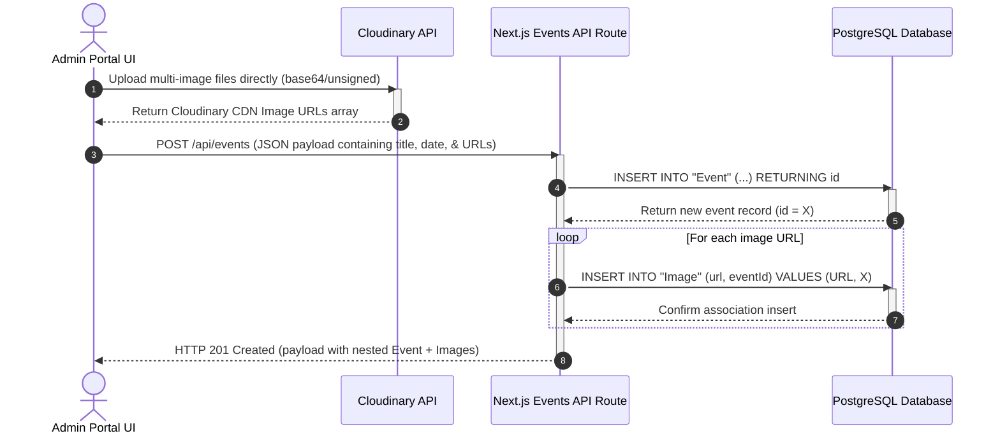
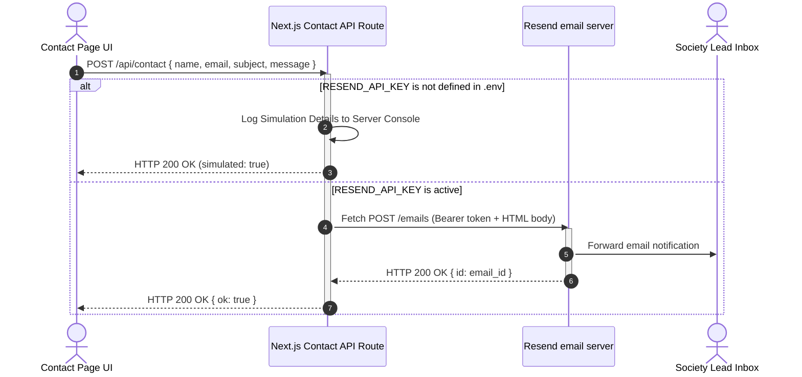
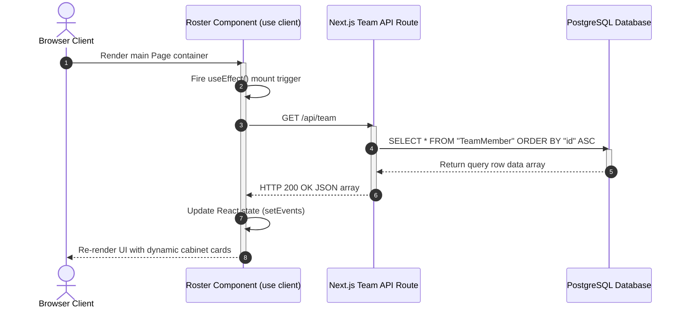

# CS Society (CSS) Web Portal — Technical Documentation & Architecture Manual

This document serves as the official, comprehensive technical documentation for the **Computer Science Society (CSS)** web platform at the **International Islamic University, Islamabad (IIUI)**. It describes the design patterns, system architecture, database models, API flows, and software dependencies of the application.

---

## 1. System Architecture

The CSS Web Portal is engineered as a monolithic modern web application using the **Next.js 15 App Router** framework. It integrates frontend client components, server-rendered layouts, and API route controllers into a single unified deployment.

### High-Level Architectural Flow


### Key Architectural Decisions
1. **ORM Elimination (Raw SQL):** We eliminated Prisma and heavy ORM libraries in favor of native PostgreSQL bindings using node-postgres (`pg`). This allows for maximum query execution speed, transparency in code, and direct transaction controls.
2. **Server-Side API Boundaries:** API endpoints are written as standard Next.js route handlers located under `src/app/api/`. They execute on the server-side, securing environment credentials (such as database URLs and API keys) from client leakage.
3. **Decoupled Media Management:** Media files (such as event slideshows, alumni headshots, and news covers) are uploaded directly to the Cloudinary CDN. Only the CDN URLs are persisted in the database. This prevents binary data storage from bloating the relational database, ensuring high-speed queries.
4. **Resend REST API Direct Binding:** Email dispatch is implemented directly via clientless standard HTTP requests (`fetch`) to the Resend API endpoints. This avoids importing third-party libraries, keeping the codebase extremely lightweight.

---

## 2. System Class Diagram

The database models and service managers are structured in a relational object paradigm. The class diagram below maps out the entities in PostgreSQL along with their types, relations, and core service layers.



---

## 3. Sequence Diagrams (Key Flows)

The following diagrams illustrate the dynamic run-time interactions between components for the application's most critical operations.

### Flow A: Dynamic Event Creation with Multi-Image Slideshow Upload
This sequence diagram shows how an administrator uploads multiple images, creates a new event, and cascades the association into the database without blocking the client.



### Flow B: Contact Form Submission and Real-time Email Dispatch
This diagram details the sequence where a student or sponsor submits the contact form, leading to a silent simulation or real email dispatch to the society lead via Resend.



### Flow C: Public Client Data Retrieval (e.g., Core Cabinet Team Grid)
This sequence shows the retrieval flow for client pages where components fetch dynamic listings from PostgreSQL asynchronously post-mount.



---

## 4. Libraries & Dependencies

The dependencies in `package.json` are optimized to keep compilation targets clean, fast, and simple. All redundant and bulky third-party libraries (including ORMs like Prisma, custom text-editors like Tiptap, and heavy server-side image processors like sharp) have been completely pruned.

### Dependency Rationale Matrix

| Dependency | Category | Rationale | Why Not an Alternative? |
| :--- | :--- | :--- | :--- |
| **`next` (v15.4.6)** | Core Framework | Provides serverless API routes, optimized static pre-rendering, and client-side page transitions in a single integrated project directory. | Replaces express + standard react, which require separate server-hosting architectures. |
| **`react` & `react-dom` (v19.1.0)** | Frontend Core | Industry-standard declarative UI engine. Next.js relies directly on its components. | Native JavaScript code is too verbose for complex responsive layouts. |
| **`pg` (v8.16.3)** | Database Driver | High-performance PostgreSQL client pool allowing direct connection and execution of raw SQL queries. | Replaces Prisma ORM. By running pure SQL, we avoid heavy compile-time ORM clients and memory overhead. |
| **`cloudinary` (v2.10.0)** | Media Service | Server-side image deletion helper (during admin asset removals) to clear obsolete files. | Replaces local disk storage. Keeping uploads in the cloud keeps backups small. |
| **`next-cloudinary` (v6.17.5)** | Media Frontend | Component package providing standard secure widgets allowing unsigned files to be uploaded from browsers directly to Cloudinary. | Direct REST calls require complex chunked signatures and custom upload loops. |
| **`react-icons` (v4.12.0)** | Icon Utility | Package grouping popular SVG icon libraries (FontAwesome, Lucide). Used for roster social badges. | Reduces asset loading by bundling only the specific vector elements used during build. |
| **`bcrypt` (v6.0.0)** | Cryptography | Industry standard one-way blowfish password hashing algorithm to secure admin records. | Replaces plain-text comparison. Necessary to ensure database breach protection. |
| **`zod` (v4.1.11)** | Data Validation | Type-safe schema validation engine used to clean, check, and cast raw inputs prior to SQL insertion. | Direct JS manual conditions are error-prone and hard to maintain across APIs. |

---

## 5. System Execution Deep-Dive

### Raw SQL and Case Sensitivity Conventions
Because PostgreSQL automatically converts non-quoted identifier names to lowercase, all tables and columns generated during database migrations require explicit **double-quoting** in raw SQL queries.
* **Incorrect:** `SELECT id, gradYear FROM Alumni` (Errors out, database searches for `alumni` and `gradyear`).
* **Correct:** `SELECT "id", "gradYear" FROM "Alumni"` (Executes correctly, matching PascalCase table and camelCase column definitions).

### Clean & Silent Admin CMS Rows
Success banners and standard browser notifications (`alert(...)`) were removed entirely from the Administrative CMS. State transitions are processed silently in the client state followed by immediate program-controlled route redirects, preserving a modern, fluid user experience. 

Furthermore, data listings inside the administrator controls are configured in sleek, horizontal flex layouts. Instead of ugly legacy stacked list views, parameters (such as Avatar, Full Name, Designation, and Actions) are aligned in strict, spacious horizontal columns.

### Cross-Origin Image Downloader
In the public visual gallery (`src/app/gallery/page.jsx`), downloading external resources directly is often blocked by browser CORS restrictions (opening images in a new tab instead of initiating a download). To bypass this, we implemented a custom blob generator:
```javascript
const handleDownload = async (url, filename) => {
  try {
    const response = await fetch(url);
    const blob = await response.blob();
    const blobUrl = window.URL.createObjectURL(blob);
    
    const link = document.createElement('a');
    link.href = blobUrl;
    link.download = filename || 'download.png';
    document.body.appendChild(link);
    link.click();
    document.body.removeChild(link);
    window.URL.revokeObjectURL(blobUrl);
  } catch (err) {
    console.error("Downloader failure:", err);
  }
};
```

### SMTP Email Simulation vs Live Delivery
To ensure zero operational downtime, the `/api/contact` API route contains a fallback handler:
1. **Simulation Mode:** If no `RESEND_API_KEY` is present in the server's `.env`, the API logs the sender, recipient, subject, and body into the server logs and returns a `simulated: true` response. This allows frontend testing to pass successfully out-of-the-box.
2. **Live Mode:** Once the administrator adds their `RESEND_API_KEY` key to the cloud env, fetch requests are dispatched to Resend's secure email API using standard onboarding domain headers, instantly routing emails to `abusart2023@gmai.com`.

---

## 6. Directory File Map

* `src/app/` — All routing segments and visual pages.
  * `layout.js` — Main page container, custom webfonts, and **explicit favicon-16x16.png mappings**.
  * `globals.css` — Core zinc-obsidian CSS variables, global scrollbars, and customized typography.
  * `page.js` — Core homepage assembling Hero, Events, and FAQ elements.
  * `about/` — Static about page showcasing society history (freed of cellular grid files and joining forms).
  * `alumni/` — Graduated alumni grid sorted by priority index.
  * `team/` — Core cabinet roster showing live LinkedIn/Instagram/FB badges.
  * `gallery/` — Media page containing the responsive image grid and **CORS blob downloaders**.
  * `contact/` — Compact message dispatcher linked to the Resend API handler.
* `src/app/admin/` — Locked administrative panels.
  * `page.jsx` — Administrative index panel.
  * `login/` — Standard secure dashboard access point.
  * `events/new/` — Slideshow event creator allowing multiple Cloudinary assets to be added in parallel.
  * `team/`, `alumni/`, `gallery/`, `news/` — Silent CMS managers aligned in clean horizontal flex rows.
* `src/app/api/` — Backend raw SQL database queries.
* `src/components/` — Global design components.
  * `Navbar.jsx` — Sticky header controller.
  * `Footer.jsx` — Branded footer including only Instagram/LinkedIn and the CSS corporate brand logo.
  * `EventSlideshow.jsx` — Dynamic event slides carousel component.
* `src/lib/` — Client connection drivers.
  * `db.js` — standard PostgreSQL pg.Pool pool loader.
  * `cloudinary.js` — Media uploads API configuration.